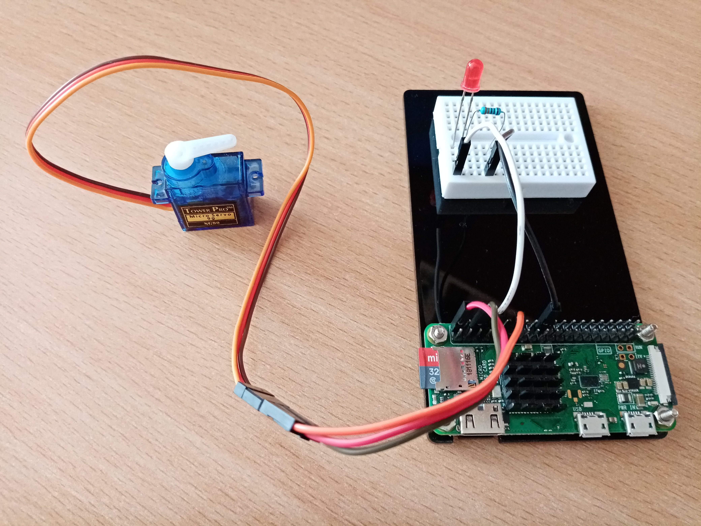

# Getting and displaying weather information with Python

*Some Python scripts for retrieving weather data using Yahoo Weather API and then displaying it using Raspberry Pi, servo motor and LED or on HTML dashboard*

## The source of data

The weather information is perhaps the best source of free data an IoT device could get from the outer world. 

[Yahoo Weather API](https://developer.yahoo.com/weather) could bring to you up-to-date weather information for any location, including 10-day forecast, wind, atmosphere, astronomy conditions, and more. You can lookup weather by location (city name) or lat/long.

In 2019 Yahoo changed its Weather API to use OAuth1 Authentication. So to get access to the weather data you have to register on Yahoo and get your API keys. Start [here](https://developer.yahoo.com/apps/create) to create an app. Use for the app any name you like (for example, MyWeather), leave Description and Home Page URL fields blank and enter any Redirect URI(s), I used this one: https://example.com.

After you get "App ID", "Client ID (Consumer Key)", and "Client Secret (Consumer Secret)" enter these data into the the appropriate fields of the scripts attached.

## The bunch of code

* **CurrentWeather.py** creates the same name class that gets the weather information for the city selected, for example, "Yekaterinburg" and show this city name, temperature, weather conditions and wind speed for the moment

* **WeatherData.py** revisits the code from CurrentWeather.py and adds a method to return a value from 0-100 to indicate the weather as a single number. When determining this number, the code takes into account the temperature and wind speed, with 0 being extreme winterlike conditions and 100 being very hot extreme summer conditions. Then this number will be used to control the servo in WeatherDashboardCW.py. The code also checks whether it is raining and update the LED to indicate whether or not we need an umbrella. The LED blinks in the dashboard if there is a thunderstorm, keep solid when there is rain or showers and goes off under all other conditions

* **WeatherDataCW.py** makes the same as WeatherData.py, but before showing servo and LED values displays the same weather data as CurrentWeather.py

* **WeatherDashboard.py** uses the data provided in the WeatherData class to control the servo and LED. Before starting using the servo is corrected in the same way as in ServoCorrection.py. So the servo shows the weather's value and the LED indicates if we need an umbrella

* **WeatherDashboardCW.py** is the same as WeatherDashboard.py but additionally displays the weather data, weather value and LED value before starting to control the servo and LED

* **WeatherDataForHTML.py** modifies CurrentWeather.py a little bit and makes it more suitable for WeatherDashboardHTML.py. It adds an extra method called getTime returning the time for displaying on the web page

* **WeatherDashboardHTML.py** is used for generating a web weather dashboard. It gets data from WeatherDataForHTML.py and creates the webpage with the help of CherryPy web framework and Bootstrap front-end toolkit

## Gratitudes

The code given here is based on the example code from the book [Internet of Things Programming Projects](https://github.com/PacktPublishing/Internet-of-Things-Programming-Projects) by Colin Dow, published by Packt. The [yahoo-weather](https://github.com/M-Ahadi/yahoo_weather) Python library was developed by Mojtaba Ahadi. I would like to express my sincere gratitudes to both of them.
